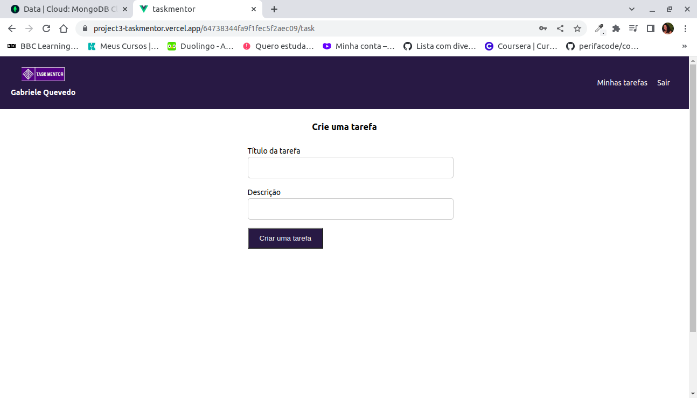

# Gestão de Tarefas
Um aplicativo de gestão de tarefas pode usar elementos de gamificação para tornar o processo de conclusão de tarefas mais divertido e gratificante. Os usuários podem ganhar pontos ou moedas virtuais ao concluir tarefas (desbloquear recompensas e avatares personalizáveis) e competir com outros usuários em desafios de produtividade.

## Desenvolvedor(a)
Gabriele Soares Quevedo

## Bastidores
Uso dos componentes do Vue
Aprendi a utilizar a plataforma de hospedagem Vercel

## Tecnologias
- Vue
- Vercel
- Naive Ui
- Node
- MongoDB

## Link de acesso
https://project2-gsquevedo.vercel.app/
